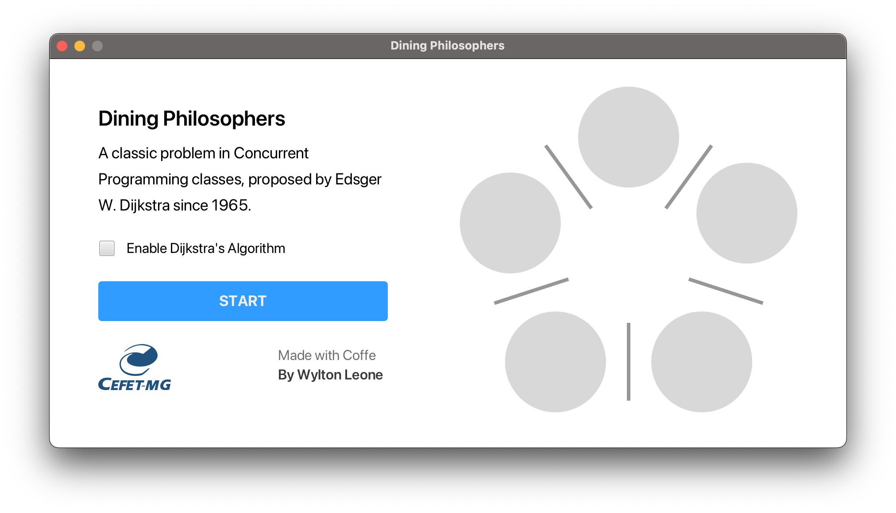
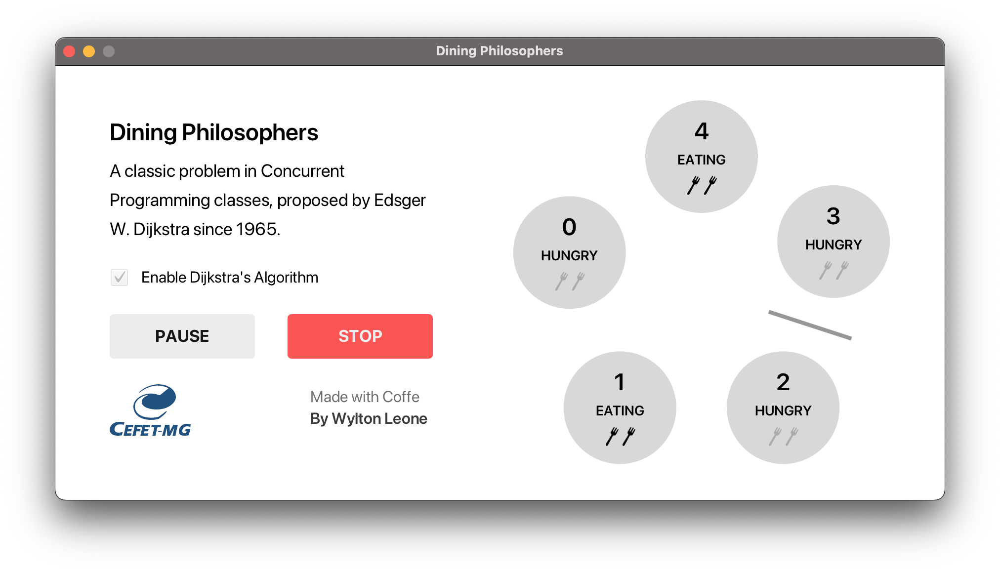

<b>A classic problem in Concurrent Programming classes, proposed by Edsger W. Dijkstra since 1965.</b>

## About

This implementation simulates the dining philosophers problem. Dijkstra's algorithm can be enabled to prevent deadlocks.

## License

See [LICENSE](/LICENSE).